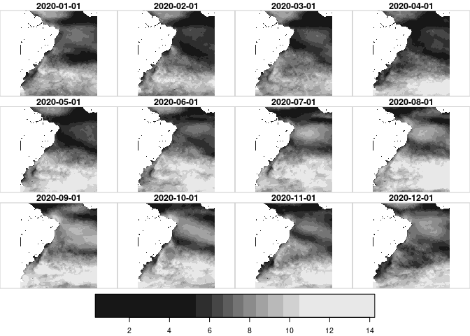
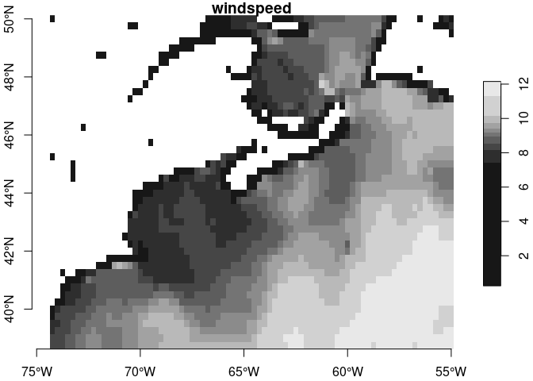
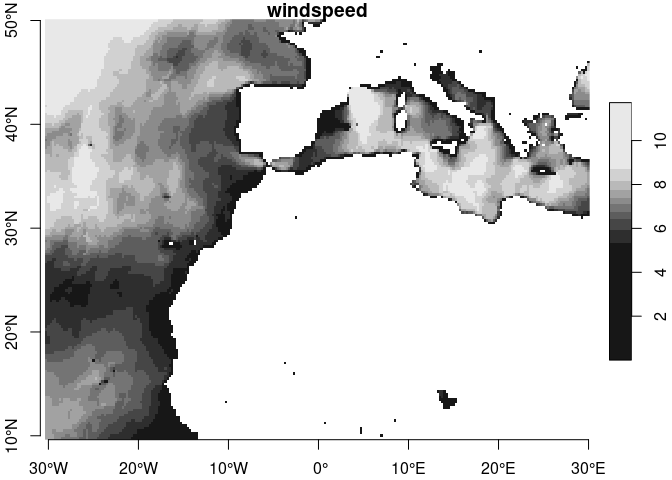

An R package to access NOAA NCEI Blended Seawinds (NBS v2)
================

Provides for access to [NBS
2.0](https://coastwatch.noaa.gov/cwn/products/noaa-ncei-blended-seawinds-nbs-v2.html)
from [NOAA Coastwatch](https://coastwatch.noaa.gov/cwn/index.html) which
replaces the first version called [Blended Sea
Winds](https://www.ncei.noaa.gov/products/blended-sea-winds) online.

### [Citation](https://doi.org/10.3389/fmars.2022.935549)

> Saha, K.; Huai-Min, Z. Hurricane and Typhoon Storm Wind Resolving NOAA
> NCEI Blended Sea Surface Wind (NBS) Product. Frontiers in Marine
> Sciences – Ocean Observation 2022, 9, 1–12.
> <https://doi.org/10.3389/fmars.2022.935549>.

### Requirements

From CRAN…

-   [R v4+](https://www.r-project.org/)
-   [rlang](https://CRAN.R-project.org/package=rlang)
-   [dplyr](https://CRAN.R-project.org/package=dplyr)
-   [tidyr](https://CRAN.R-project.org/package=tidyr)
-   [stars](https://CRAN.R-project.org/package=stars)
-   [sf](https://CRAN.R-project.org/package=sf)
-   [R6](https://CRAN.R-project.org/package=R6)

### Installation

    remotes::install_github("BigelowLab/nbs")

``` r
suppressPackageStartupMessages({
  library(nbs)
  library(dplyr)
  library(sf)
  library(stars)
})
```

#### Organization of Blended Seawinds

Blended Sea Winds are organized by product and interval. The two primary
product types are wind velocities and wind stresses. Each product type
is organized further by aggregation interval `[6h, daily, monthly]`. In
addition, NOAA/NCEI serves up both “near real time” (NRT) and
science-digest versions (SCI).

``` r
nbs_tally()
```

    ## Error in Rsx_nc4_get_vara_int: NetCDF: DAP failure
    ## Var: time  Ndims: 1   Start: 0 Count: 13135

    ## Warning in FUN(X[[i]], ...): unable to open:stress_SCIDailyGlobal

    ## # A tibble: 7 × 5
    ##   name                    vars                  time_count start      end       
    ##   <chr>                   <chr>                      <int> <date>     <date>    
    ## 1 uvcomp_SCISixHourGlobal u_wind, v_wind             52540 1987-07-09 1987-07-09
    ## 2 stress_SCISixHourGlobal x_tau, y_tau               52540 -243006-0… -243006-0…
    ## 3 uvcomp_SCIDailyGlobal   u_wind, v_wind, wind…      13135 1987-07-09 1987-07-09
    ## 4 uvcomp_SCIMonthlyGlobal u_wind, v_wind, wind…        431 1987-07-23 1987-07-23
    ## 5 stress_SCIMonthlyGlobal x_tau, y_tau                 431 1987-07-23 1987-07-23
    ## 6 uvcomp_NRTSixHourGlobal u_wind, v_wind               884 2023-01-01 2023-01-01
    ## 7 stress_NRTSixHourGlobal x_tau, y_tau                 888 -243006-0… -243006-0…

#### Opening a session with a product

``` r
X = NBS2$new(product = 'uvcomp_SCIMonthlyGlobal')

times = X$get_time()
head(times)
```

    ## [1] "1987-07-23" "1987-08-15" "1987-09-15" "1987-10-15" "1987-11-15"
    ## [6] "1987-12-15"

``` r
tail(times)
```

    ## [1] "2022-12-15" "2023-01-15" "2023-02-15" "2023-03-15" "2023-04-15"
    ## [6] "2023-05-15"

#### Extracting with bounding boxes

The grid is a regular WGS84 `longlat` grid, but you should note that the
longitudes range from (0, 360) and not (-180, 180).

You can either manually specify a bound box in (xmin, ymin, xmax, ymax)
order, or provide an `sf-like` object from which the bounding box is
extracted. Below we extract 12 months (from 2020), bind as one stars
object and display.

``` r
bb = c(290, -60, 360, 10)
dates = seq(from = as.Date("2020-01-01"), 
            to = as.Date("2020-12-01"), 
            by = "month")
windspeeds = lapply(seq_along(dates),
                function(imonth){
                  X$get_var(bb = bb, varid = "windspeed", 
                            form = 'stars', time = dates[imonth])
                }) 
windspeed = do.call(c, append(windspeeds, list(along = list(date = dates))))
plot(windspeed)
```

<!-- -->

#### The pesky \[-180, 180\] vs \[-0, 360\] issues

It seems like most mapping paradigms we see are mapped in the range
\[-180, 180\], but certainly not all. If you have a bounding box using
the \[-180, 180\] style, then simply convert it using the provided
functionality. Below we show how to transform a bounding box, make the
extraction and then ‘shift’ the result to \[-180, 180\] space.

``` r
bb_180 = c(-74, 39, -55, 50)
bb_360 = bb_to360(bb_180)
windspeed_360 = X$get_var(bb = bb_360, time = as.Date("1995-12-01"), varid = "windspeed")
sf::st_bbox(windspeed_360)
```

    ##    xmin    ymin    xmax    ymax 
    ## 285.625  38.625 305.125  50.125

``` r
plot(windspeed_360, axes = TRUE)
```

<!-- --> Now we can
shift the stars object to be in the \[-180, 180\] space.

``` r
windspeed_180 = stars_to180(windspeed_360)
sf::st_bbox(windspeed_180)
```

    ##    xmin    ymin    xmax    ymax 
    ## -74.375  38.625 -54.875  50.125

``` r
plot(windspeed_180, axes = TRUE)
```

<!-- -->

#### Crossing the edge

How does one get a single object if the bounding box crosses the edge?
It’s simple, really, to split the bounding box into two, extract each
separately and then use `stars::st_mosaic()` to merge them into a single
object.

First we’ll make a bb in \[-180, 180\] space, then split it into 2 at 0
degrees.

``` r
bb_over_edge_180 = c(-30, 10, 30, 50)
bbs_180 = bb_split(bb_over_edge_180, at = 0)
bbs_180
```

    ## $bb1
    ## [1] -30  10   0  50
    ## 
    ## $bb2
    ## [1]  0 10 30 50

We convert each to \[0,360\].

``` r
bbs_360 = lapply(bbs_180, bb_to360)
bbs_360
```

    ## $bb1
    ## [1] 330  10 360  50
    ## 
    ## $bb2
    ## [1]  0 10 30 50

Now we collect a \[0,360\] stars object for each bb, shifting to \[-180,
180\] as needed before mosaicing.

``` r
xx = lapply(bbs_180,
            function(bb_180){
              X$get_var(time = as.Date("1989-01-01"),
                        varid = "windspeed",
                        bb= bb_to360(bb_180)) |>
                stars_to180()
            })
windspeed = stars::st_mosaic(xx[[1]], xx[[2]]) 
plot(windspeed, axes = TRUE)
```

<!-- --> }
